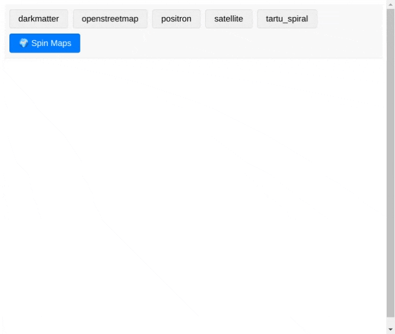

# Maplibre Map Synchronization Demo on Elixir Phoenix/LiveView

🌍 Simple Map Synchronization

Check out this demo showcasing synchronized multiple map viewers built with Elixir, Phoenix LiveView, and MapLibre GL JS - all in a single file!

This compact solution demonstrates how functional programming enables us to blend server-side rendering with responsive client-side interactions, creating a seamless mapping experience with minimal code.

Curious? Full source code available here: https://github.com/LandscapeGeoinformatics/elixir_phoenix_maplibre_magic

University of Tartu [Chair of Geoinformatics and Cartography](https://geograafia.ut.ee/en/node/111545)

